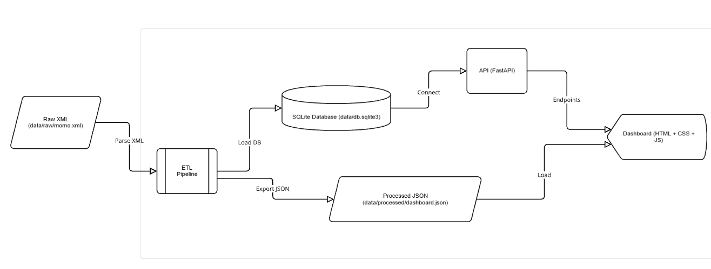

#  MoMo SMS data processor

##  Project Overview
This project is an **enterprise-level fullstack application** designed to process **MoMo SMS data in XML format**.  
The system will:
- Parse, clean, and categorize SMS transaction data  
- Store records in a relational database for persistence  
- Expose structured data through a backend API  
- Provide a frontend dashboard for visualization and analysis  

This project is part of our continuous formative assessment and tests our skills in:
- **Backend data processing**
- **Database design & management**
- **Frontend development**
- **Agile collaboration**

---

##  Team Information
**Team Name:** TriByte 

**Members:**
- Member 1: Merci Nzabinesha
- Member 2: Mutaganzwa Gift Desire 
- Member 3: Shakira Munganyinka 

---

## High-Level System Architecture
Our architecture consists of four main layers:  

1. **Data Source** → Incoming MoMo SMS in XML format  
2. **Backend Processor** → Parses XML, cleans data, categorizes transactions  
3. **Database Layer** → Relational DB (SQLite) for structured storage  
4. **Frontend Interface** → Web app with dashboards, charts, and search/filter  

 **Diagram:**  
  

 **Diagram Link:** [View on miro ](https://miro.com/app/board/uXjVJLVGmFo=/)

---

## Database Documentation
You can find the database documentation here.
[Database Design Document.pdf](https://github.com/user-attachments/files/22433689/Database.Design.Document.pdf)

## Project Report
Final PDF Report: [MoMo SMS Data Processor — Report.pdf](https://github.com/user-attachments/files/22902606/MoMo.SMS.Data.Processor.Report.pdf)


## Agile Workflow (Scrum Setup)
We are following **Scrum practices** to manage our development process.  

- **Board Tool:** [Trello]  
- **Columns:**  
  - To Do  
  - In Progress  
  - Done  

 **Scrum Board Link:** [View Board](https://trello.com/b/avGAlbms/momo-sms-dataprocessor)  


##  Repository Structure 
```bash
MoMo-SMS-data_processor/
├── api
│   └── server.py
├── backend
├── data
│   └── processed
├── database
│   └── database_setup.sql
├── docs
│   ├── api_docs.md
│   ├── architecture.png
│   ├── Database Design Document.pdf
│   ├── Documentation-for_ERD.pdf
│   └── erd_diagram.png.png
├── dsa
│   ├── parse_xml.py
│   ├── __pycache__
│   └── search.py
├── examples
│   ├── json_schemas.json
│   └── modified_sms_v2.xml
├── frontend
├── README.md
└── screenshots
    ├── DELETE - remove a transaction.png
    ├── GET transactions by ID.png
    ├── POST - add a new transaction.png
    ├── PUT - update a transaction.png
    ├── Screenshot 2025-10-09 183411.png
    ├── Screenshot 2025-10-09 183453.png
    ├── Screenshot 2025-10-09 183752.png
    ├── Screenshot 2025-10-09 183926.png
    └── Screenshot 2025-10-09 184146.png

## JSON to Database Mapping

| SQL Table              | JSON Field / Object       | Notes |
|------------------------|--------------------------|-------|
| Users                  | Sender, Receiver         | Nested in Full_Transaction |
| Transactions           | TransactionID, Amount, Status, Date | Top-level fields in Full_Transaction |
| Transaction_Categories | Category                 | Nested object in Full_Transaction |
| Tags                   | Tags array               | Many-to-many relation |
| System_Logs            | Logs array               | Linked via TransactionID |
